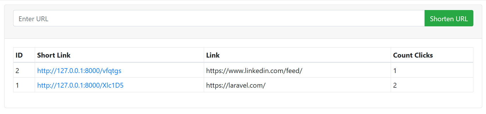

# URL Shortner Application

The URL Shortener Application is a web-based tool that allows users to convert long URLs into short, unique links. This system not only makes sharing URLs easier but also provides additional functionality such as click tracking.

## Key features - 
* URL Shortening:
    1. User can input any valid long URL.
    2. The system generates a unique, shortened URL for the input URL.
**2. Unique URL Generation:**
    - Each shortened URL is unique and redirects to the original URL. 
    - The generated URLs are easy to share and use. 
**3. Click Tracking:** 
    - Track the number of times each shortened URL is clicked. 
**4. User-Friendly Interface:**
    - Simple, intuitive design for entering URLs and retrieving shortened links. 
    - Quick access to click statistics for each URL.

## Example Workflow:
    - A user inputs https://example.com/some/very/long/url.
    - The application generates a unique short URL like https://short.ly/abc123.
    - When the short URL is clicked, the user is redirected to the original URL, and the click count is incremented.

## Use Cases: 
    - Simplify sharing long URLs on social media platforms.
    - Track engagement with marketing links.
    - Enhance the user experience by creating manageable and memorable links.

This application is a practical solution for managing and monitoring web links efficiently.
